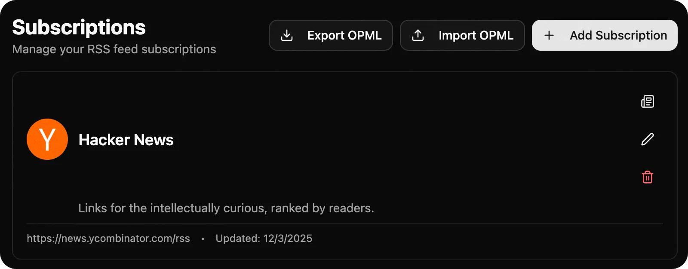
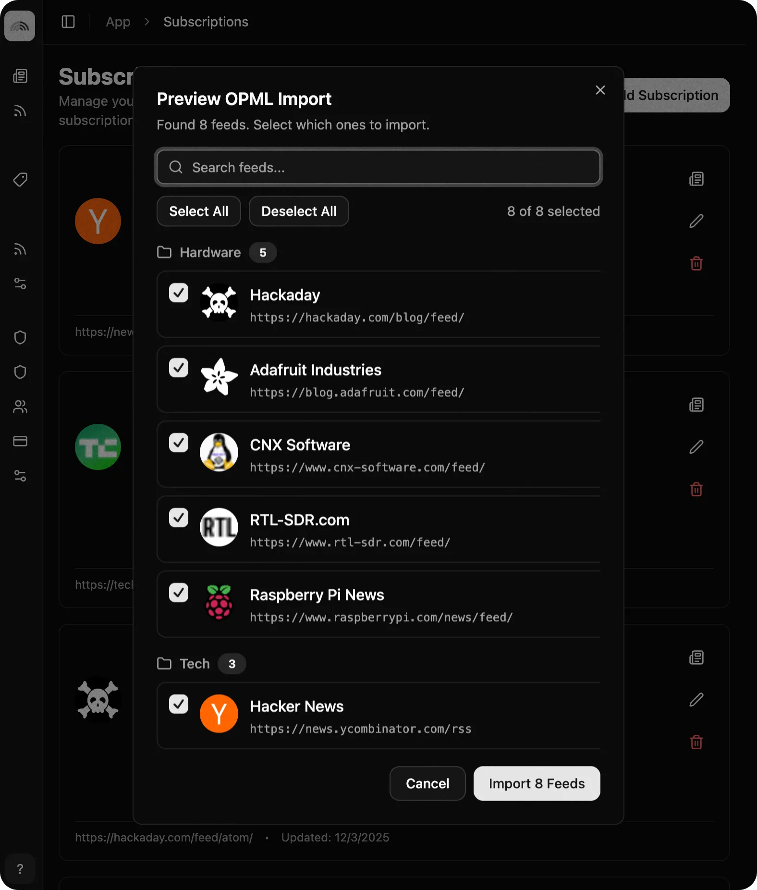

# Create and Share Feed Lists with OPML

One of the great things about RSS is that it's open and portable. You can easily migrate your subscriptions from one RSS reader to another using **OPML** files.
It's also a great way to curate feed lists and share them with others.
Have a collection of really cool bloggers that all document their experiences hand crafting traditional Polish wooden clogs?
Neat! You can easily share or publish that list of blogs with others.

## Exporting Your Tuvix Subscriptions

Exporting your feeds from Tuvix is simple:

1. Go to your [Subscriptions page](https://feed.tuvix.app/app/subscriptions)
2. Look for the button labeled "Export" or with a down arrow icon.
3. Click the button to download your OPML file.

Tuvix exports everything — your feeds, categories, and even your custom filters—so you can restore your exact setup later or share it with others.
If you import your Tuvix OPML file into any other RSS reader, it will import your feeds and categories. However, it will not import your custom filters.

## Getting Started with Curated Feed Lists

New to RSS? Not sure where to start? We've created several curated OPML files to help you get started quickly. Download any of these curated OPML files and import just the feeds you want to subscribe to.

### Tech Feed List

Stay up to date with the latest in technology, programming, and software development. This list includes feeds from major tech blogs, developer communities, and technology news sites.

#### Feeds Included

- **Hackaday** - Hardware hacking and maker projects
- **Adafruit Industries** - Electronics and maker tutorials
- **CNX Software** - Embedded systems and single-board computers
- **RTL-SDR.com** - Software-defined radio news and projects
- **Raspberry Pi News** - Official Raspberry Pi updates and projects
- **Hacker News** - Tech news and discussions from the Y Combinator community
- **The Verge** - Technology news and reviews
- **Ars Technica** - In-depth tech journalism and analysis

<a href="/assets/share/opml/tech.opml" class="inline-flex items-center gap-2 px-4 py-2 bg-orange-500 text-white font-medium rounded-md hover:bg-orange-600 transition-colors no-underline !text-white !no-underline" style="color: white; text-decoration: none;">
  <svg xmlns="http://www.w3.org/2000/svg" width="20" height="20" viewBox="0 0 24 24" fill="white" class="text-white">
    <path d="M6.002 15.999a2 2 0 1 0-.004 4a2 2 0 0 0 .004-4M6 4a2 2 0 0 0 0 4c5.514 0 10 4.486 10 10a2 2 0 0 0 4 0c0-7.72-6.28-14-14-14m0 6a2 2 0 0 0 0 4c2.205 0 4 1.794 4 4a2 2 0 0 0 4 0c0-4.411-3.589-8-8-8"/>
  </svg>
  Download Tech Feed List
</a>

### News Feed List

Get your news from diverse, mainstream sources. This curated list includes feeds from reputable news organizations across the political spectrum, including mainstream left, right, and neutral sources for balanced coverage.

#### Feeds Included

- **The New York Times** - Comprehensive national and international news
- **The Guardian** - Global news and investigative journalism
- **The Washington Post** - In-depth reporting and political coverage
- **NPR** - Public radio news and analysis
- **Fox News** - Conservative news and commentary
- **National Review** - Conservative opinion and analysis
- **The Hill** - Political news and Capitol Hill coverage
- **BBC News** - International news from the British Broadcasting Corporation
- **Reuters** - Global news agency with neutral reporting

<a href="/assets/share/opml/news.opml" class="inline-flex items-center gap-2 px-4 py-2 bg-orange-500 text-white font-medium rounded-md hover:bg-orange-600 transition-colors no-underline !text-white !no-underline" style="color: white; text-decoration: none;">
  <svg xmlns="http://www.w3.org/2000/svg" width="20" height="20" viewBox="0 0 24 24" fill="white" class="text-white">
    <path d="M6.002 15.999a2 2 0 1 0-.004 4a2 2 0 0 0 .004-4M6 4a2 2 0 0 0 0 4c5.514 0 10 4.486 10 10a2 2 0 0 0 4 0c0-7.72-6.28-14-14-14m0 6a2 2 0 0 0 0 4c2.205 0 4 1.794 4 4a2 2 0 0 0 4 0c0-4.411-3.589-8-8-8"/>
  </svg>
  Download News Feed List
</a>

### Podcasts Feed List

Discover great podcasts across all genres. Browse popular shows on [Apple Podcasts](https://podcasts.apple.com/us/charts), covering technology, entertainment, news, true crime, comedy, and more.

> **Tip**: For podcasts, we recommend adding them directly using Apple Podcasts URLs rather than OPML files. While Apple Podcasts URLs aren't RSS feeds, Tuvix is smart enough to use them to fetch extra information like high-quality artwork for the podcast. OPML files only support RSS feed URLs, which for podcasts often don't contain the same artwork quality.

#### Some Personally Curated Podcasts

Here are some great podcasts to get you started. Simply copy the Apple Podcasts URL and add it to Tuvix:

- [The Philip DeFranco Show](https://podcasts.apple.com/us/podcast/the-philip-defranco-show/id1278424954) - Daily news and commentary
- [The Daily](https://podcasts.apple.com/us/podcast/the-daily/id1200361736) - The New York Times' daily news podcast
- [Good Hang with Amy Poehler](https://podcasts.apple.com/us/podcast/good-hang-with-amy-poehler/id1795483480) - Conversations with interesting people
- [NPR News Now](https://podcasts.apple.com/us/podcast/npr-news-now/id121493675) - Up-to-the-minute news updates
- [The Daily Show: Ears Edition](https://podcasts.apple.com/us/podcast/the-daily-show-ears-edition/id1334878780) - The Daily Show in podcast form
- [Pluribus: The Official Podcast](https://podcasts.apple.com/us/podcast/pluribus-the-official-podcast/id1846198705) - Tech and culture discussions
- [Lateral with Tom Scott](https://podcasts.apple.com/us/podcast/lateral-with-tom-scott/id1648140033) - Puzzle and riddle show

Learn more about [how to subscribe to podcasts in Tuvix](/blog/how-to-subscribe-podcasts-tuvix).

### Finance Feed List

Keep track of financial news, market updates, and economic analysis. This list includes feeds from financial news sites, economic blogs, and market analysis sources.

#### Feeds Included

- **Bloomberg** - Global financial news and market data
- **Wall Street Journal** - Business and financial news
- **Financial Times** - International business and finance
- **CNBC** - Business news and market coverage
- **MarketWatch** - Stock market news and analysis
- **Reuters Business** - Global business and financial news
- **The Economist** - Economic analysis and global affairs
- **Forbes** - Business news and financial insights
- **Fortune** - Business leadership and market trends
- **Barron's** - Investment news and market analysis

<a href="/assets/share/opml/finance.opml" class="inline-flex items-center gap-2 px-4 py-2 bg-orange-500 text-white font-medium rounded-md hover:bg-orange-600 transition-colors no-underline !text-white !no-underline" style="color: white; text-decoration: none;">
  <svg xmlns="http://www.w3.org/2000/svg" width="20" height="20" viewBox="0 0 24 24" fill="white" class="text-white">
    <path d="M6.002 15.999a2 2 0 1 0-.004 4a2 2 0 0 0 .004-4M6 4a2 2 0 0 0 0 4c5.514 0 10 4.486 10 10a2 2 0 0 0 4 0c0-7.72-6.28-14-14-14m0 6a2 2 0 0 0 0 4c2.205 0 4 1.794 4 4a2 2 0 0 0 4 0c0-4.411-3.589-8-8-8"/>
  </svg>
  Download Finance Feed List
</a>

### TV & Movies Feed List

Stay in the loop with entertainment news, reviews, and discussions about TV shows and movies. This list includes feeds from entertainment news sites, review blogs, and fan communities.

#### Feeds Included

- **Entertainment Weekly** - Entertainment news, reviews, and features
- **Variety** - Entertainment industry news and analysis
- **The Hollywood Reporter** - Film and television industry coverage
- **IndieWire** - Independent film and TV news
- **Rotten Tomatoes** - Movie and TV reviews and ratings
- **IGN Movies** - Movie reviews and entertainment news
- **IGN TV** - TV show reviews and entertainment coverage
- **Collider** - Movie and TV news, reviews, and interviews
- **Vulture** - Entertainment news and cultural commentary
- **Den of Geek** - TV and movie news, reviews, and fan culture

<a href="/assets/share/opml/tv-movies.opml" class="inline-flex items-center gap-2 px-4 py-2 bg-orange-500 text-white font-medium rounded-md hover:bg-orange-600 transition-colors no-underline !text-white !no-underline" style="color: white; text-decoration: none;">
  <svg xmlns="http://www.w3.org/2000/svg" width="20" height="20" viewBox="0 0 24 24" fill="white" class="text-white">
    <path d="M6.002 15.999a2 2 0 1 0-.004 4a2 2 0 0 0 .004-4M6 4a2 2 0 0 0 0 4c5.514 0 10 4.486 10 10a2 2 0 0 0 4 0c0-7.72-6.28-14-14-14m0 6a2 2 0 0 0 0 4c2.205 0 4 1.794 4 4a2 2 0 0 0 4 0c0-4.411-3.589-8-8-8"/>
  </svg>
  Download TV & Movies Feed List
</a>

## Sharing Your Feed Lists

Found a great collection of feeds? Share it with others! You can:

- Post it to an old-school forum
- Host it on your own website or blog
- Share it in Discord
- Put it on your grandma's tablet

## Pro Tips

> **Tip**: Export your OPML file from Tuvix or other RSS readers to migrate to other RSS readers.

> **Tip**: Create separate OPML files for different topics. Export individual categories to create focused feed lists you can share.

> **Tip**: When importing OPML files, review the feeds before subscribing. Make sure they're still active and relevant to your interests.

## Take Control of Your Feeds

OPML makes RSS truly portable and shareable. Export your subscriptions, share your favorites, and discover new feeds through community-curated lists. Whether you're backing up your feeds or sharing your favorite sources, OPML keeps you in control.

Ready to get started? Download our curated feed lists and begin building your personalized RSS collection today! 📡

