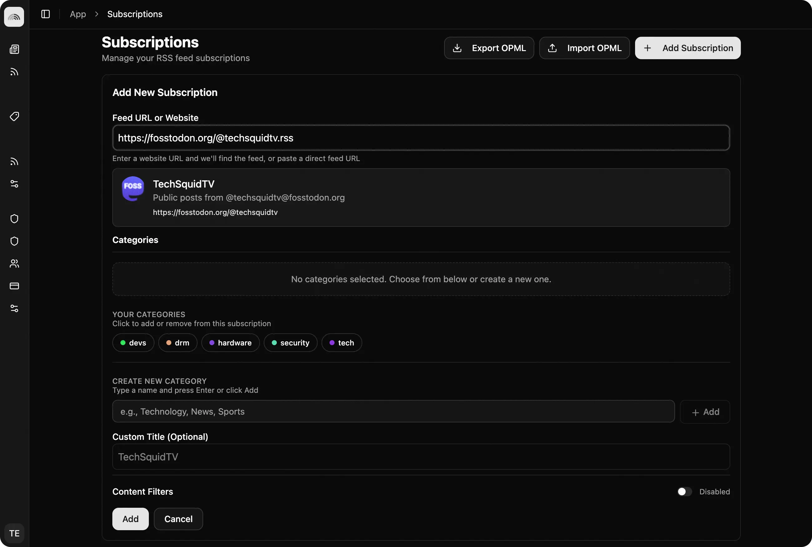

# How to Follow Anyone on Twitter, Mastodon, or Bluesky Using RSS

Ever seen an app that shows posts from everyone you follow from multiple platforms in one place? One of oldest standards on the web (RSS) has been making it possible for years, without any fancy apps.

## Why Use RSS for Social Media?

- **No Algorithms**: See posts in the order they were published
- **No Tracking**: Your reading habits stay private. No accounts, no logins, no ads.
- **Cross-Platform**: Follow creators across Twitter, Mastodon, and Bluesky in one place
- **No Ads**: did we say no ads?
- **Better Control**: Organize feeds by topic, creator, or platform

## Following Twitter/X Accounts

Twitter doesn't provide native RSS feeds, there are several open source bridges out there that offer RSS feeds for Twitter users, free of charge. And, you can always host your own.

Nitter is a privacy-focused Twitter frontend that provides RSS feeds. **Important:** Not all Nitter instances offer RSS feeds publicly, and the main `nitter.net` instance is currently offline. You'll need to find a working instance that supports RSS.

1. Find a [working Nitter instance](https://github.com/zedeus/nitter/wiki/Instances) that supports RSS feeds.
1. View the Twitter username you want to follow (e.g., `@techsquidtv`)
1. append `/rss` to the end of the Nitter instance URL:
   ```
   https://nitter.privacyredirect.com/techsquidtv/rss
   ```
1. Add this RSS feed to Tuvix

**Note:** Instance availability can change. If one stops working, try another from the list. You can check the [Nitter instances status page](https://status.d420.de) for current availability.

## Following Mastodon Accounts

Mastodon and many of the modern open social media platforms support RSS out of the box, as most websites did before the concerns of advertising and data collection became the norm.

Mastodon accounts automatically generate RSS feeds for each user's post. tuvix will automatically detect the feed with just the user's profile URL. If you did want to see the RSS feed manually, you can just append `.rss` to the end of the user's profile URL.

1. Locate the Mastodon user's profile URL (e.g., https://fosstodon.org/@techsquidtv)
2. Enter the URL into Tuvix and it will automatically detect the feed.
3. Subscribe!



### Following Mastodon Hashtags

You can also follow hashtags on Mastodon:

```
https://mastodon.social/tags/hashtag.rss
```

Replace `hashtag` with the actual hashtag name (without the `#` symbol). this is excellent for monitoring topics rather than individual users.

## Following Bluesky Accounts

Bluesky offers native RSS feeds for all profiles on the official `bsky.app` service. Tuvix will automatically detect the RSS feed from any Bluesky profile URL.

1. Locate the Bluesky user's profile URL (e.g., `https://bsky.app/profile/techsquidtv.com`)
2. Enter the URL into Tuvix and it will automatically detect the feed.
3. Subscribe!

The profile URL will automatically redirect to the RSS feed. For example, `https://bsky.app/profile/techsquidtv.com/rss` redirects to the actual feed URL (which uses a DID identifier like `https://bsky.app/profile/did:plc:oz77hubxks5xam76om26ioev/rss`).

**Note:** If you host your own AT Protocol account on a different server, you may need to provide the RSS link directly if it uses a different URL format than `bsky.app`.

## Pro Tips

### Tip 1: Combine Multiple Accounts

Follow several creators in the same category to create a custom timeline. Want to see all web dev content? Add feeds from Twitter, Mastodon, and Bluesky creators into one category.

### Tip 2: Use Hashtag Feeds

Mastodon hashtag feeds are powerful—follow `#Movies` or `#IndieWeb` to discover new creators and content.

### Tip 3: Backup Your Feeds

Export your feeds regularly using OPML format. This way, if you switch RSS readers or need to restore, you have a backup.

### Tip 4: Filter by Keywords

Some RSS readers (including Tuvix) let you filter posts by keywords. Use this to focus on specific topics even within a creator's feed.

## Limitations to Be Aware Of

- **Rate Limits**: Some services may have rate limits on how often feeds update
- **Service Availability**: Third-party services like Nitter instances may go down
- **Media**: Images and videos may not always display perfectly in RSS feeds. It depends on the publisher's settings. Some may only include the URL, others may include the image or video file directly.
- **Replies**: Most bridge services or native feeds will not include replies to the original post.

You will always be able to open the link to the feed item to see the original post and any replies, or attached media.

## Take Back Your Feed

Take back control of your social media consumption with RSS! 📡. Check out our other blog posts for more tips and tricks on how to use Tuvix.
