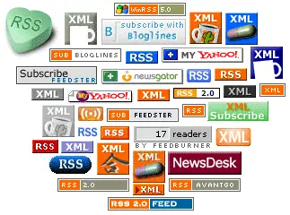
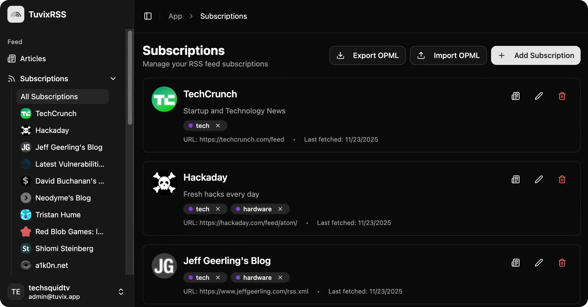
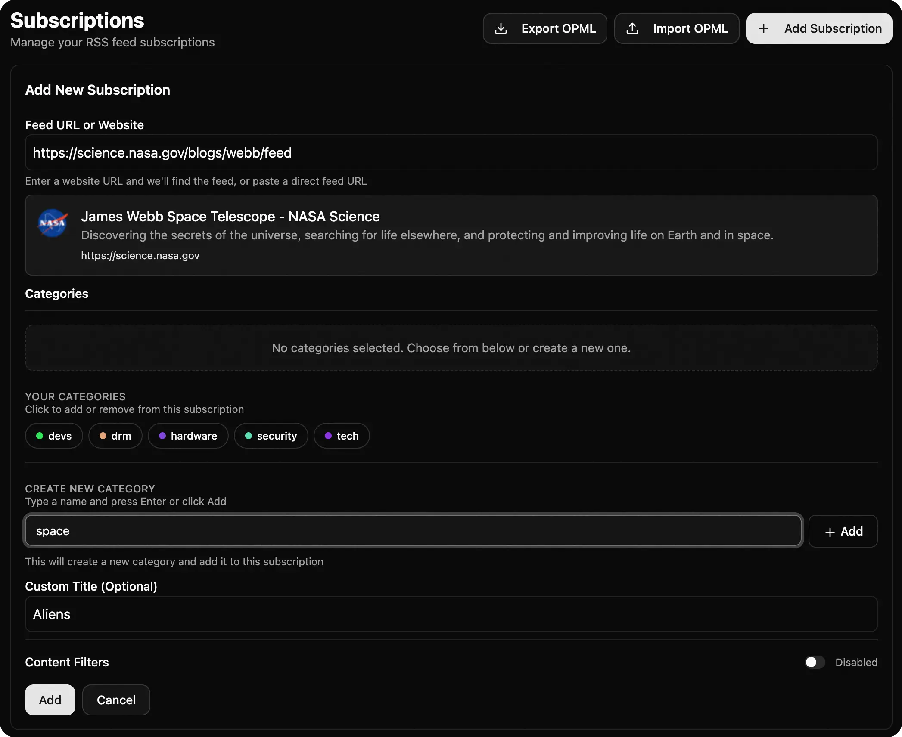
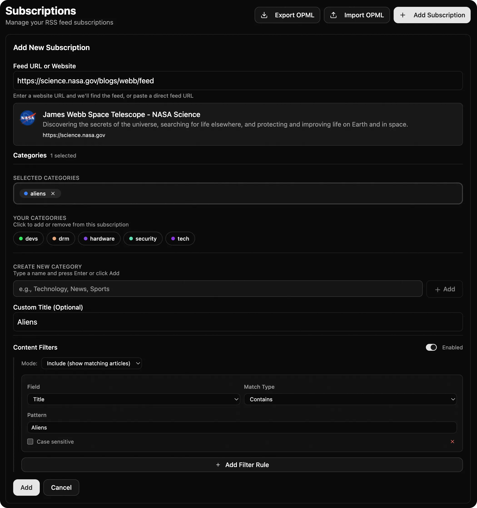

# Getting Started with RSS and Tuvix

Welcome to the world of RSS! If you're tired of algorithmic feeds deciding what you should read, you're in the right place. This guide will help you understand RSS and get started with Tuvix.

## What is RSS?

RSS (Really Simple Syndication) is a web feed format that allows you to follow updates from your favorite websites without visiting each one individually. Think of it as a universal "subscribe" button for the web.

Badges like these used to be all over the web. Now you'll hardly see the RSS icons or badges, but many websites and services still support RSS feeds, even if they don't advertise it.

## Why Use RSS?

- **No Algorithms**: Content appears in chronological order
- **Privacy**: No accounts required, no tracking of your reading habits
- **Control**: You see exactly what you subscribe to and nothing more
- **Centralization**: Keep up with dozens or even hundreds of sources in one place

## Getting Started with Tuvix

### 1. Create Your Account

Tuvix is a free and open source app. You can run it yourself on your own computer or server, or sign up with our free hosted version.

Sign up for a free Tuvix account at [feed.tuvix.app](https://feed.tuvix.app). No credit card required.

### 2. Add Your First Feeds

Start subscribing to your favorite websites and blogs. Tuvix will try to automatically discover any available feeds from the website, so don't worry about trying to find a specific feed URL.

### 3. Organize with Categories

Create categories to organize your feeds by topic. when adding a feed to Tuvix, you'll ahve the opporunity to add existing categories or create new ones.

Categories help you group feeds by topic, like building your own subreddits or newsletters.

### 4. Filter Your Feeds

Tuvix offers robust filtering options to help you focus on just the content you want to see. You can search by "Title", "Content", "Description" or "Author", and you can set the type of matching from "Contains", "Exact", or a "Regex" expression. It is somewhat rare for feeds to include the full content these days, so I'd recommend using the "Title" for most cases.

Say you wanted to monitor several space-related websites for news of alien life, you could create a category for "Aliens" and then add multiple filtered feeds to it.

## Pro Tips

> **Tip**: Many sites that do not offer an official RSS feed, can still be monitored with a bridge service, like https://rss.app/

> **Tip**: Export your feeds and back them up to OPML format. Tuvix will include your feed filters and categories in the OPML file so you can easily re-import them into your own self-hosted instance.

> **Tip**: RSS feeds do not provide instant notifications like push notifications or newsletters. RSS feeds are updated about ever 15 minutes or so, so beware that you may not want to rely on RSS for time-critical applications.

> **Tip**: You can always open the link to the feed item to see the original post and any replies, or attached media.

Happy reading! 📚
