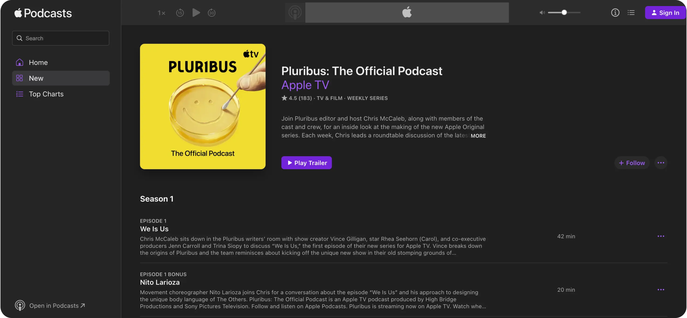
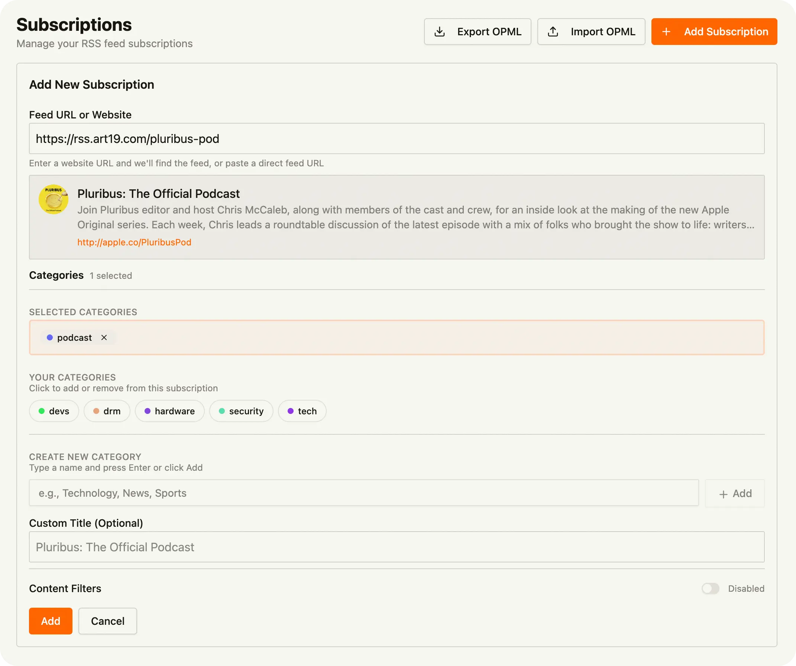

# How to Subscribe and Listen to Podcasts on Tuvix

When podcasts were catching on in popularity in the early 2010s, one of the great things about them, was how easy and cheap they were to host yourself. Anyone who could setup a blog with an RSS feed, could also host a podcast; assuming they had a microphone. Podcast apps were just RSS readers with a built-in audio player.

Today, podcasting has largely been centralized into a few major platforms, like Apple Podcasts, Spotify, and Google Music. Luckily, so far, Apple Podcasts still offers RSS feeds for most podcasts, so you can still subscribe to them using RSS feeds. Spotify and Google Music, on the other hand, lock their content behind invasive tracking and advertising.
## Getting Started with Podcasts

If you've used the Apple Podcasts app before, you'll be right at home with Tuvix. Tuvix just supports subscribing to more than just podcasts. You'll be able to listen to blog posts as well if they publish audio.

### 1. Find Your Podcast

Head over to Apple Podcasts and find the show you want. Just copy the URL from the podcast page:

```
https://podcasts.apple.com/us/podcast/pluribus-the-official-podcast/id1846198705
```



That's it! Tuvix will grab everything it needs automatically—the episodes, artwork, and all that good stuff.

### 2. Add the Podcast to Tuvix

Go to [https://feed.tuvix.app/app/subscriptions](https://feed.tuvix.app/app/subscriptions) and hit "Add Subscription".

Paste that Apple Podcasts URL you copied, and Tuvix will fetch the podcast feed. 



### 3. Organize with Categories

Keep things organized by putting podcasts into categories. Some ideas:
- **"Podcasts"** - All your shows
- **"TV Podcasts"** - Shows about TV and streaming
- **"News Podcasts"** - Daily news and current events

Categories help you find stuff faster, and you can even turn them into a shareable feed if you want to share your favorites with friends. Think of them like playlists, but for more than just audio.

### 4. Listen to Episodes

New episodes show up in your feed automatically. Catch new episodes in your main feed when they come out, you can also click into any specific subscription to see all of the episodes for that show.

Audio-enabled posts, like podcasts, will have a built-in audio player. Just click play to listen to the episode.


## Pro Tips

> **Tip**: Want to see show notes or transcripts? Just click through to the original episode page.

> **Tip**: New episodes usually show up within 15 minutes of being published.

> **Tip**: Create a generic "Podcasts" category to keep all of your audio content in one place.

Happy listening! 🎧

